# Module 5 — Attendance: Class Diagram

Drawn directly from the code per the MVC + Repository conventions (CLAUDE.md §4–5).
Call direction is strictly `Route → Service → Repository → Supabase`; types in `src/types/Attendance.ts` are shared by all layers.

Render with any Mermaid viewer (VSCode Markdown Preview + Mermaid extension, mermaid.live, or draw.io import).

```mermaid
classDiagram
    direction TB

    %% ───────── Controller layer (src/app/api) ─────────
    class AttendanceRoute {
        <<Controller>>
        +GET(req) dashboard / requests / my-requests
        +PATCH(req) action dispatcher
        manager_review / final_review
        submit_shift_swap / respond_shift_swap / withdraw_shift_swap
        decide_shift_swap / decide_time_off
        submit_fixed_off_day / decide_fixed_off_day
        apply_ai_approvals
    }
    class ShiftSwapSettingsRoute {
        <<Controller>>
        +GET(req)
        +PUT(req)
    }
    class OffDaySettingsRoute {
        <<Controller>>
        +GET(req)
        +PUT(req)
    }
    class AttendanceAISuggestRoute {
        <<Controller>>
        +POST(req)
    }
    class AITimesheetsRoute {
        <<Controller>>
        +POST(req)
    }

    %% ───────── Service layer (src/services) ─────────
    class attendanceService {
        <<Service>>
        +getAttendanceDashboard(company_id) AttendanceDashboard
        +getAttendanceByDateRange(company_id, from, to) AttendanceDashboardRecord[]
        +managerReviewAttendance(input: AttendanceManagerReviewInput)
        +finalReviewAttendance(input: AttendanceReviewInput)
        +getShiftSwapRequests(company_id) ShiftSwapRequestView[]
        +submitShiftSwapRequest(input: ShiftSwapRequestCreateInput)
        +respondShiftSwapRequest(input: ShiftSwapCounterpartDecisionInput)
        +withdrawShiftSwapRequest(input: ShiftSwapWithdrawInput)
        +decideShiftSwapRequest(input: ShiftSwapOwnerDecisionInput)
        +getFixedOffDayRequests(company_id) FixedOffDayRequestView[]
        +submitFixedOffDayRequest(input)
        +decideFixedOffDayRequest(input: FixedOffDayDecisionInput)
        +decideFixedOffDayRequestGroup(input: FixedOffDayDecisionGroupInput)
        +getTimeOffRequests(company_id) TimeOffRequestView[]
        +decideTimeOffRequest(input) TimeOffRequestView
        +getMyRequests(user_id)
        +getUpcomingApprovedOffDates(user_id) string[]
    }
    class shiftSwapSettingsService {
        <<Service>>
        +getSettings(company_id) ShiftSwapSettings
        +upsertSettings(input: ShiftSwapSettingsUpsertInput) ShiftSwapSettings
    }
    class offDaySettingsService {
        <<Service>>
        +getSettings(company_id)
        +upsertQuota(input: OffDayQuotaUpsertInput)
        +upsertDeadline(input: OffDaySubmissionDeadlineUpsertInput)
    }
    class requestAISuggestService {
        <<Service>>
        +suggestFixedOffDayGroup(request)
        +suggestFixedOffDayQueue(input)
    }
    class timesheetAutoApprovalService {
        <<Service>>
        +reviewTimesheets(company_id)
        +applyAutoApprovals(company_id, owner_id, minConfidence)
    }

    %% ───────── Repository layer (src/repositories) ─────────
    class attendanceRepository {
        <<Repository>>
        +getAssignmentsByCompany(company_id) AssignmentWithShift[]
        +getAttendanceRecordsByAssignmentIds(ids) AttendanceRecord[]
        +updateAttendanceRecord(id, fields) AttendanceRecord
        +getShiftSwapRequestsByCompany(company_id) ShiftSwapRequest[]
        +createShiftSwapRequest(input) ShiftSwapRequest
        +updateShiftSwapRequest(id, fields) ShiftSwapRequest
        +countApprovedShiftSwapsForUser(company_id, user_id, from, to) number
        +getOffDayRequestsByCompany(company_id) FixedOffDayRequest[]
        +createFixedOffDayRequests(input) FixedOffDayRequest[]
        +updateFixedOffDayRequest(id, fields) FixedOffDayRequest
        +getTimeOffRequestsByCompany(company_id) TimeOffRequestRow[]
        +updateTimeOffRequest(id, fields) TimeOffRequestRow
        +getMovableTasksByShiftAssignment(assignment_id)
        +updateShiftAssignmentUser(assignment_id, user_id) ShiftAssignment
        +... (40+ query methods)
    }
    class shiftSwapSettingsRepository {
        <<Repository>>
        +getByCompany(company_id) ShiftSwapSettings
        +upsert(input) ShiftSwapSettings
    }
    class offDaySettingsRepository {
        <<Repository>>
        +getQuotaSettings(company_id) OffDayQuotaSetting[]
        +upsertQuota(input) OffDayQuotaSetting
        +getDeadline(company_id) OffDaySubmissionDeadline
        +upsertDeadline(input) OffDaySubmissionDeadline
    }

    %% ───────── Entity / DTO types (src/types/Attendance.ts) ─────────
    class AttendanceRecord {
        <<Entity>>
        +id: string
        +shift_assignment_id: string
        +clock_in_at: string
        +clock_out_at: string
        +employee_status: AttendanceRequestStatus
        +manager_status: AttendanceRequestStatus
        +owner_status: AttendanceOwnerStatus
        +exception_type: AttendanceExceptionType
    }
    class ShiftSwapRequest {
        <<Entity>>
        +id: string
        +company_id: string
        +requester_assignment_id: string
        +counterpart_assignment_id: string
        +counterpart_status: ShiftSwapCounterpartStatus
        +status: ShiftSwapStatus
    }
    class ShiftSwapSettings {
        <<Entity>>
        +company_id: string
        +auto_approval_enabled: boolean
        +monthly_swap_limit: number
        +deadline_hours_before_shift: number
        +require_review_on_limit_exceeded: boolean
        +require_review_on_deadline_exceeded: boolean
    }
    class FixedOffDayRequest {
        <<Entity>>
        +id: string
        +user_id: string
        +company_id: string
        +week_start: string
        +off_date: string
        +status: AttendanceRequestStatus
        +source: FixedOffDaySource
    }
    class TimeOffRequestView {
        <<DTO>>
        +id: string
        +user_id: string
        +type: TimeOffRequestType
        +status: AttendanceRequestStatus
    }

    class Supabase {
        <<external>>
    }

    %% ───────── Relationships (call flow = sequence diagram order) ─────────
    AttendanceRoute --> attendanceService : calls
    AttendanceRoute --> timesheetAutoApprovalService : apply_ai_approvals
    ShiftSwapSettingsRoute --> shiftSwapSettingsService : calls
    OffDaySettingsRoute --> offDaySettingsService : calls
    AttendanceAISuggestRoute --> requestAISuggestService : calls
    AITimesheetsRoute --> timesheetAutoApprovalService : calls

    attendanceService --> attendanceRepository : calls
    attendanceService --> shiftSwapSettingsService : reads swap rules
    shiftSwapSettingsService --> shiftSwapSettingsRepository : calls
    offDaySettingsService --> offDaySettingsRepository : calls
    requestAISuggestService --> attendanceRepository : reads
    timesheetAutoApprovalService --> attendanceRepository : reads/writes

    attendanceRepository --> Supabase : queries
    shiftSwapSettingsRepository --> Supabase : queries
    offDaySettingsRepository --> Supabase : queries

    attendanceService ..> AttendanceRecord : uses
    attendanceService ..> ShiftSwapRequest : uses
    attendanceService ..> FixedOffDayRequest : uses
    attendanceService ..> TimeOffRequestView : returns
    shiftSwapSettingsService ..> ShiftSwapSettings : uses
```

## UC coverage in this diagram

| UC | Entry point |
|---|---|
| UC49 Clock In / Out | `casual/attendance`, `employee/attendance` routes (own services/repos, same pattern) |
| UC50–51 Review / View Status | `attendanceService.getAttendanceDashboard`, `managerReviewAttendance`, `finalReviewAttendance` |
| UC52–53 Shift Swap | `submitShiftSwapRequest` → `respondShiftSwapRequest` → `decideShiftSwapRequest` |
| UC54–55 Fixed Day Off | `submitFixedOffDayRequest` → `decideFixedOffDayRequest(Group)` |
| UC56 Modify Clock Time | `finalReviewAttendance` (owner_status = `modified`) |
| UC57 AI Review Requests | `requestAISuggestService`, `timesheetAutoApprovalService` |
